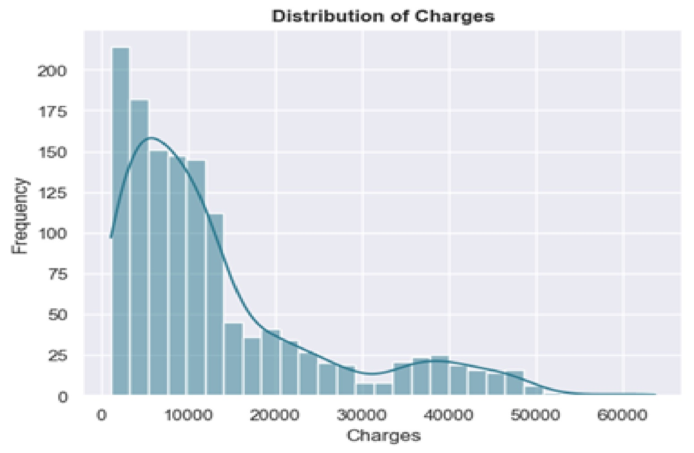
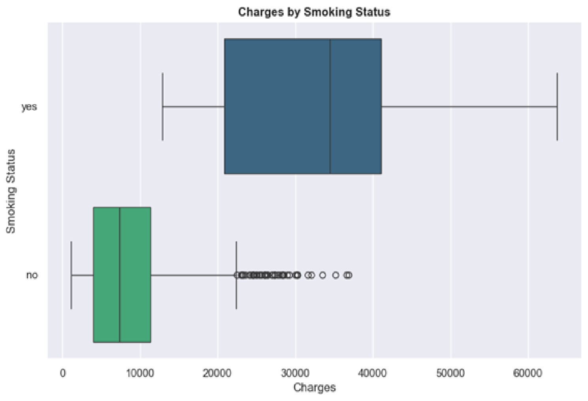
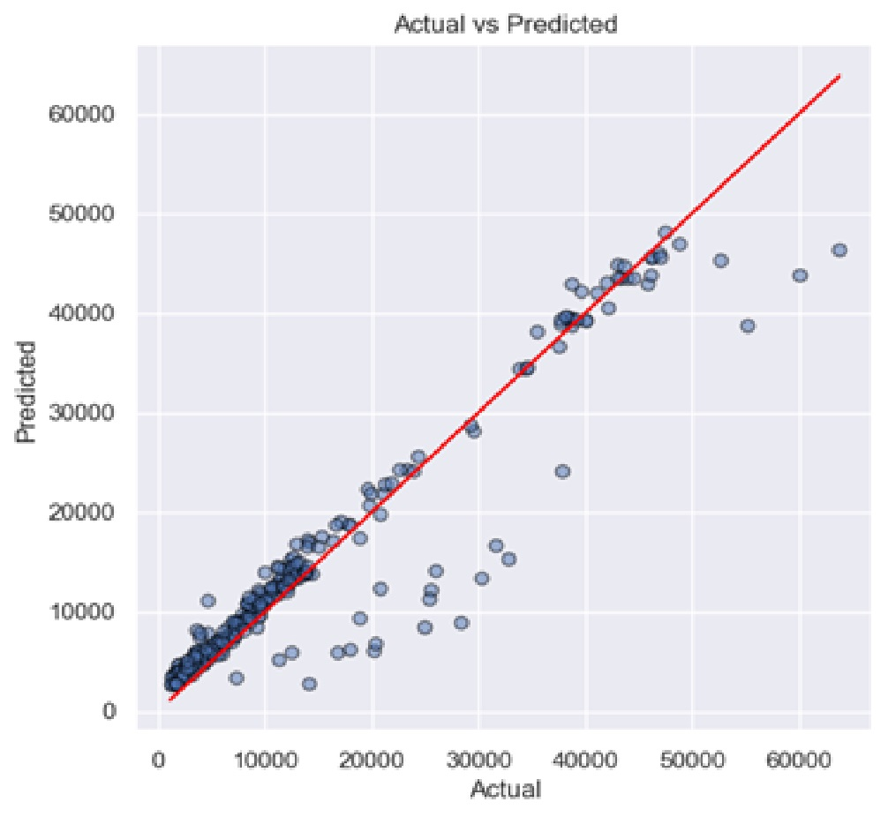
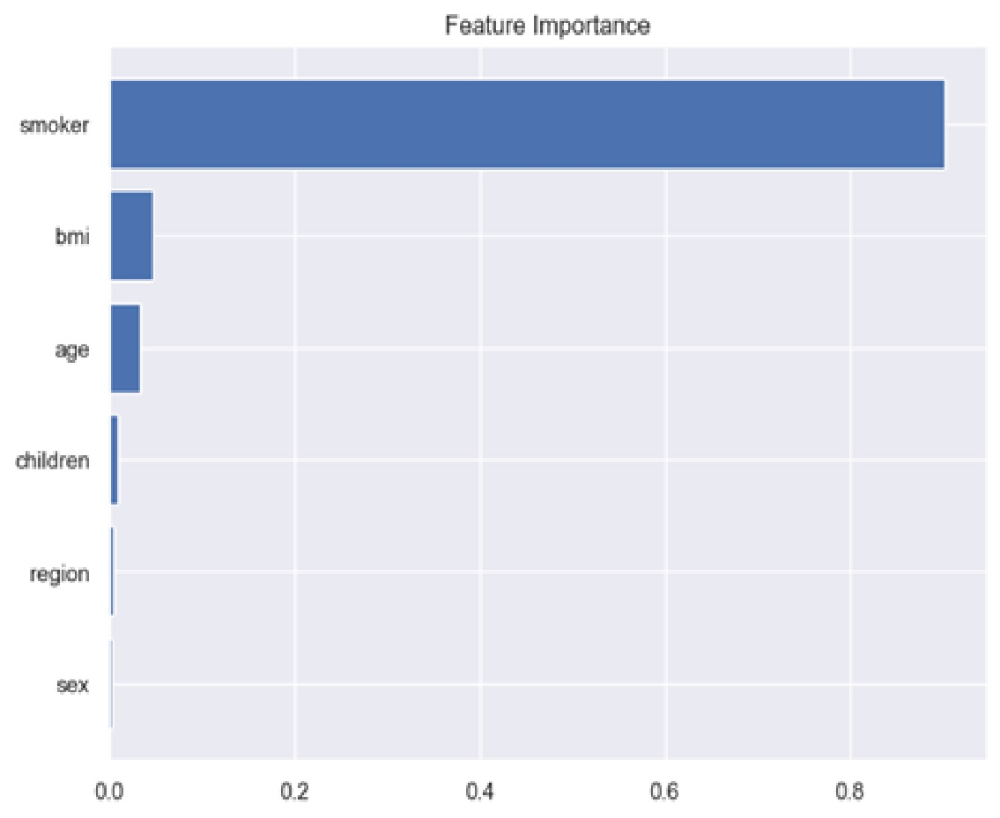
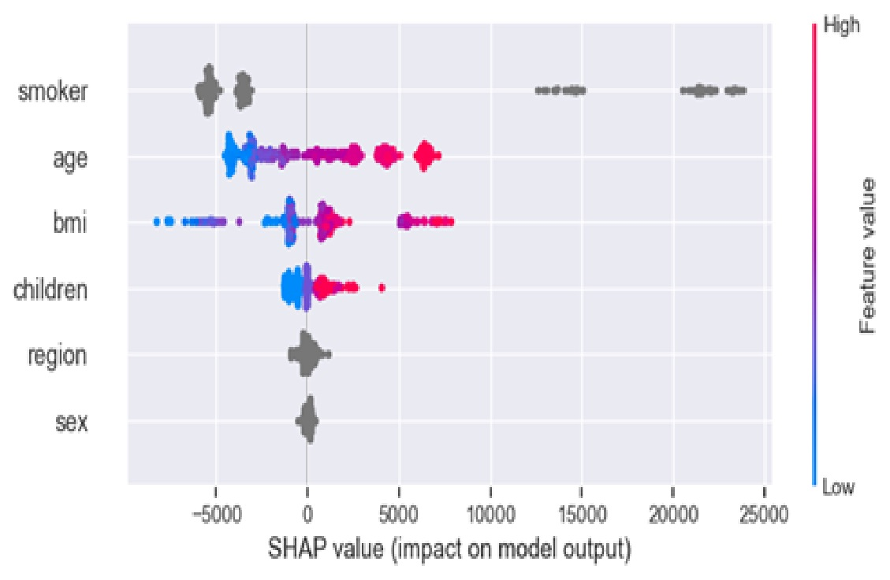

# Predicting Medical Insurance Costs

## Projecr Overview
This project presents a machine learning workflow for predicting medical insurance charges using demographic, lifestyle, and health-related data from the [Medical Cost Personal Dataset](https://www.kaggle.com/datasets/mirichoi0218/insurance)  
The analysis includes data validation, exploratory data analysis, feature engineering, model development, hyperparameter tuning, model evaluation, and explainable AI using SHAP to interpret model predictions. 

---
## Problem statement
It is very important for insurance and healthcare organizations to accurately estimate medical insurance costs because it supports
- Premium estimation
- Pricing strategies
- Customer segmentation
- Financial planning
- Risk assessment 
The main objective of this project is to determine whether medical insurance costs can be predicted given an individual's characteristics.

---
## Dataset
The data was sourced from Kaggle. 
It contains 1,338 records that describe policyholders through:
| Variable | Description                                          |
| -------- | ---------------------------------------------------- |
| Age      | Age of the primary policyholder                       |
| Sex      | Gender of the policyholder                            |
| BMI      | Body Mass Index                                      |
| Children | Number of dependents covered by the insurance policy |
| Smoker   | Smoking status                                       |
| Region   | Residential region in the United States              |
| Charges  | Individual medical insurance costs (Target Variable) |

---
## Project Workflow
**1. Data Validation** 
Dataset inspection
Data type verification
Missing value assessment
Duplicate record detection

**2. Data Cleaning** 
Performed necessary cleaning operations to improve data quality before analysis and modeling.

**3. Feature Engineering** 
Additional variables were created solely to support exploratory data analysis and were not used during model training.

**4. Exploratory Data Analysis** 
**Univariate Analysis** 
Explored the distribution of:
- Age
- BMI
- Gender
- Smoking Status
- Insurance Charges

**Bivariate Analysis** 
Investigated relationships between:
- Region vs Charges
- BMI Category vs Charges
- Smoking Status vs Charges
- Age Group vs Charges
- Gender vs Charges
- Region vs Age Group
- Number of Children vs Charges
- BMI Category vs Age Group

**Multivariate Analysis** 
Examined complex interactions among variables using:
- Age Group, Smoker, and Charges
- Region, Smoker, and Charges
- BMI Category, Smoker, and Charges
- Distribution of Numerical Variables
- Correlation Analysis
- Pairwise Numerical Relationships
- Distribution of Categorical Variables

**5. Data Preprocessing**
- Feature-target split
- Train-test split
- Feature scaling (where required)
- Categorical variable encoding
- Native categorical handling for CatBoost

**6. Baseline Model Development** 
The following regression models were trained and compared:
- Linear Regression
- Ridge Regression
- Random Forest Regressor
- Extra Trees Regressor
- LightGBM Regressor
- XGBoost Regressor
- CatBoost Regressor

Evaluation metrics included: 
MAE  - Mean Absolute Error 
MSE  - Mean Squared Error 
RMSE - Root Mean Squared Error 
MAPE - Mean Absolute Percentage Error 
R² Score - Coefficient of Determination 

**7. Hyperparameter Tuning** 
Hyperparameter tuning was performed using cross-validation to improve predictive performance.
Each model was assigned an appropriate hyperparameter search space before selecting the optimal configuration.

**8. Model Comparison** 
Baseline and tuned models were compared to evaluate the effectiveness of hyperparameter optimization.

**9. Feature Importance** 
The final model's feature importance was analysed to determine which variables contributed most to prediction accuracy.

**10. Model Explainability** 
SHAP was used to explain both global and local model behaviour through:
- SHAP Feature Importance
- SHAP Beeswarm Plot
- SHAP Waterfall Plot

These visualizations explain: 
- which features are most influential,
- whether they increase or decrease predictions,
- and why a particular prediction was made.

**11. Model Evaluation** 
The final model was evaluated using:
- Residual Plot
- Actual vs Predicted Plot
These diagnostics were used to assess prediction accuracy and identify potential model bias.

---
## Technologies Used
- Python
- Jupyter Notebook
- Pandas
- NumPy
- Matplotlib
- Seaborn
- Scikit-learn
- CatBoost
- XGBoost
- LightGBM
- SHAP

---
## Key Findings
- Smoking status is the strongest predictor of medical insurance charges.
- BMI and age also contribute substantially to insurance cost prediction.
- Tree-based ensemble models outperform traditional linear regression models.
- Hyperparameter tuning improved model performance across all ensemble methods.
- SHAP analysis provided interpretable explanations for both individual predictions and overall model behaviour

---
## Business Recommendations
➤
➤
➤
➤
➤
➤

---
## Visualizations

### Distribution of Charges

---
### Smoking Status vs Insurance Charges

---
### Actual vs Predicted Values

---
### Feature Importance

---
### SHAP Summary

---
## Pre-Requisites

---
## Repository Structure

---
## Future Improvements

---
